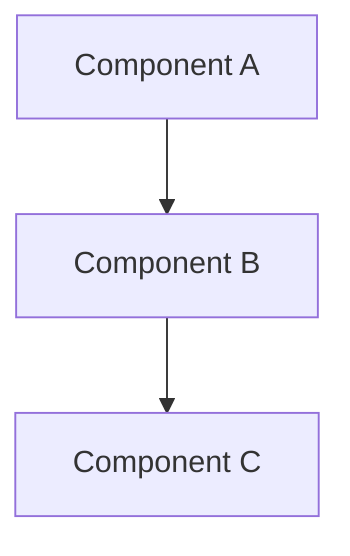

# SRE Workflows Skill

Operational workflows for Site Reliability Engineering - incident management, change proposals, and deployment procedures.

## Commands

### /incident-review

Generate incident review document from template.

**Usage**: `/incident-review <incident-id> [--severity <1-4>]`

**Output**:

```markdown
# Incident Review: {incident-id}

## Overview

| Field                 | Value         |
| --------------------- | ------------- |
| **Incident ID**       | {incident-id} |
| **Date**              | {date}        |
| **Severity**          | {severity}    |
| **Duration**          |               |
| **Customer Impact**   | Yes / No      |
| **Services Affected** |               |

## Timeline

| Time (UTC) | Event                 |
| ---------- | --------------------- |
| HH:MM      | Issue detected        |
| HH:MM      | Investigation started |
| HH:MM      | Root cause identified |
| HH:MM      | Mitigation applied    |
| HH:MM      | Service restored      |
| HH:MM      | Incident closed       |

## Summary

### What Happened

<!-- Brief description of the incident -->

### Root Cause

<!-- Technical root cause analysis -->

### Impact

<!-- Customer and business impact -->

## Detection

- **How detected**: Monitoring / Customer report / Other
- **Time to detect**: X minutes
- **Alert that fired**:

## Response

### Actions Taken

1.
2.
3.

### What Went Well

-
-

### What Could Be Improved

-
-

## Prevention

### Action Items

| Action | Owner | Due Date | Status |
| ------ | ----- | -------- | ------ |
|        |       |          |        |
|        |       |          |        |

### Monitoring Improvements

- [ ] New alerts needed
- [ ] Threshold adjustments
- [ ] Runbook updates

## Lessons Learned

<!-- Key takeaways for the team -->

---

**Review completed by**:
**Review date**:
```

---

### /proposal

Generate architecture/change proposal document.

**Usage**: `/proposal <title> [--type task|project]`

**Output**:

````markdown
# Proposal: {title}

## Metadata

| Field         | Value  |
| ------------- | ------ |
| **Author**    |        |
| **Date**      | {date} |
| **Type**      | {type} |
| **Status**    | Draft  |
| **Reviewers** |        |

## Summary

<!-- 2-3 sentence summary of what you're proposing -->

## Problem Statement

### Current State

<!-- Describe the current situation -->

### Pain Points

-
-

### Business Impact

<!-- Why this matters -->

## Proposed Solution

### Overview

<!-- High-level description of the solution -->

### Architecture


````

### Components

| Component | Purpose | Technology |
| --------- | ------- | ---------- |
|           |         |            |

### Data Flow

<!-- How data moves through the system -->

## Alternatives Considered

### Option 1: {Alternative Name}

- **Pros**:
- **Cons**:
- **Why rejected**:

### Option 2: {Alternative Name}

- **Pros**:
- **Cons**:
- **Why rejected**:

## Implementation Plan

### Phases

| Phase | Description | Duration |
| ----- | ----------- | -------- |
| 1     |             |          |
| 2     |             |          |
| 3     |             |          |

### Dependencies

-
-

### Risks

| Risk | Likelihood | Impact | Mitigation |
| ---- | ---------- | ------ | ---------- |
|      |            |        |            |

## Security Considerations

- [ ] Threat model completed
- [ ] Security review scheduled
- [ ] Compliance requirements identified

### Threat Model

<!-- Link or summary -->

## Operational Impact

### Monitoring

- New metrics needed:
- New alerts needed:

### Runbooks

- [ ] Runbook created/updated
- [ ] On-call training scheduled

### Rollback Plan

<!-- How to roll back if needed -->

## Cost Analysis

| Item      | One-time | Monthly | Notes |
| --------- | -------- | ------- | ----- |
|           |          |         |       |
| **Total** |          |         |       |

## Success Criteria

- [ ]
- [ ]
- [ ]

## Sign-off

| Role           | Name | Date | Approved |
| -------------- | ---- | ---- | -------- |
| Technical Lead |      |      | ☐        |
| Security       |      |      | ☐        |
| Operations     |      |      | ☐        |

---

````

---

### /deploy-check

Generate pre-deployment checklist.

**Usage**: `/deploy-check [--environment <dev|staging|prod>]`

**Output**:
```markdown
# Deployment Checklist: {environment}

**Date**: {date}
**Deployer**:
**Change ID**:

## Pre-Deployment

### Code & Build
- [ ] All tests passing in CI
- [ ] Code review approved
- [ ] Version bumped appropriately
- [ ] Changelog updated
- [ ] No secrets in code

### Infrastructure
- [ ] Terraform plan reviewed
- [ ] No unexpected resource changes
- [ ] State file backed up
- [ ] Resource quotas checked

### Documentation
- [ ] Runbook updated
- [ ] Architecture docs current
- [ ] API docs updated

### Communication
- [ ] Change announced in #deployments
- [ ] Stakeholders notified
- [ ] Maintenance window scheduled (if needed)

## Deployment

### Validation Steps
- [ ] Smoke tests pass
- [ ] Health checks green
- [ ] No error spikes in logs
- [ ] Metrics within normal range

### Rollback Criteria
Trigger rollback if:
- [ ] Error rate > X%
- [ ] Latency > Xms
- [ ] Health checks failing

### Rollback Command
```bash
# Rollback command here
````

## Post-Deployment

### Verification

- [ ] All services healthy
- [ ] Customer-facing functionality working
- [ ] Background jobs processing
- [ ] Integrations functioning

### Monitoring

- [ ] Watch dashboards for 30 minutes
- [ ] Check error rates
- [ ] Verify metrics

### Cleanup

- [ ] Remove feature flags (if applicable)
- [ ] Close related tickets
- [ ] Update deployment log

## Sign-off

| Check           | Completed | Time |
| --------------- | --------- | ---- |
| Pre-deployment  | ☐         |      |
| Deployment      | ☐         |      |
| Post-deployment | ☐         |      |

**Deployment completed**: ☐
**Notes**:

````

---

### /runbook-template

Generate runbook template for a service or alert.

**Usage**: `/runbook-template <service-or-alert-name>`

**Output**:
```markdown
# Runbook: {name}

## Overview

**Service/Alert**: {name}
**Owner Team**:
**Escalation**:
**Last Updated**: {date}

## Description
<!-- What this service does or what this alert means -->

## Quick Reference

| Item | Value |
|------|-------|
| Dashboard | [Link]() |
| Logs | [Link]() |
| Metrics | [Link]() |
| Source Code | [Link]() |

## Alert Triage

### Severity Levels

| Severity | Response Time | Actions |
|----------|---------------|---------|
| Critical | 15 minutes | Page on-call, customer communication |
| High | 1 hour | Investigate immediately |
| Medium | 4 hours | Investigate during business hours |
| Low | 1 day | Review in next sprint |

## Diagnostic Steps

### 1. Check Service Health
```bash
# Commands to check health
````

### 2. Check Logs

```bash
# Log query commands
```

### 3. Check Dependencies

```bash
# Dependency health checks
```

## Common Issues & Resolutions

### Issue: {Common Issue 1}

**Symptoms**:
**Cause**:
**Resolution**:

```bash
# Fix commands
```

### Issue: {Common Issue 2}

**Symptoms**:
**Cause**:
**Resolution**:

```bash
# Fix commands
```

## Escalation

| Level | Contact             | When                    |
| ----- | ------------------- | ----------------------- |
| L1    | On-call             | First response          |
| L2    | Team lead           | No resolution in 30 min |
| L3    | Engineering manager | Customer impact         |

## Recovery Procedures

### Restart Service

```bash
# Restart commands
```

### Rollback

```bash
# Rollback commands
```

### Failover

```bash
# Failover commands
```

## Post-Incident

- [ ] Create incident review
- [ ] Update this runbook if needed
- [ ] Add monitoring improvements to backlog

```

---

## Workflow Integration

### Confluence
These templates are designed to be compatible with Confluence wiki format.

### Jira Integration
Action items can be converted to Jira tickets with proper labels and components.

### Alert Response
Use `/runbook-template` outputs as the basis for alert response documentation.

## Best Practices

1. **Complete reviews within SLA** - Incident reviews within 5 business days
2. **Action items are specific** - Include owner, due date, and clear definition of done
3. **Proposals get sign-off** - Technical and security review before implementation
4. **Checklists are living** - Update based on lessons learned

## References

| Topic | Source |
|-------|--------|
| Incident Management | Internal Confluence |
| Change Management | Internal Confluence |
| SRE Practices | https://sre.google/sre-book/table-of-contents/ |
```
